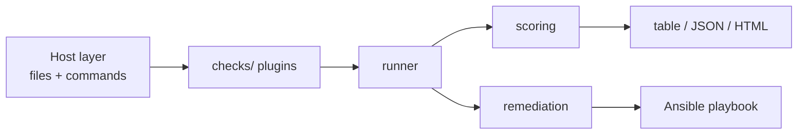

# blindagem 🛡️

> Read-only hardening auditor for Linux servers: CIS-inspired checks, a 0–100 score, an HTML report and an Ansible playbook to fix what's wrong.


<!-- Record a demo and drop it here: asciinema rec + agg, or peek.
      -->

[Leia em português](README.pt-BR.md)

## Why

Most server compromises start with boring misconfigurations: root login over SSH, a weak
password policy, a forgotten telnet service, a world-readable `/etc/shadow`. blindagem finds
them in seconds, explains what an attacker would do with each one, and generates the fix —
without changing anything on its own.

```
╭──────────── 🛡️  blindagem ────────────╮
│ 72/100  GOOD                          │
│                                       │
│ web-01 · Debian GNU/Linux 12          │
│ profile: server · running as root     │
│ coverage: 27/29 checks evaluated      │
╰───────────────────────────────────────╯
 check                sev       status  result
 accounts.extra_uid0  critical  fail    Accounts other than root have UID 0
                                          toor (UID 0, shell /bin/sh)
 ssh.root_login       high      fail    SSH allows direct root login
 perms.shadow         high      fail    /etc/shadow is too permissive
```

## Quick start

```bash
pipx install git+https://github.com/USUARIO/blindagem
sudo blindagem audit --html report.html
blindagem fix -o fix.yml && ansible-playbook -i myserver, fix.yml --check --diff
```

Or copy a single file to the server: download `blindagem.pyz` from the latest release and run
`sudo python3 blindagem.pyz audit`. No pip, no virtualenv, nothing installed on the host.

## What it does

- **29 checks** across SSH, accounts, permissions, network, kernel, updates, services and
  mount options — see [docs/checks.md](docs/checks.md).
- **A score with its coverage**, so 95 out of 3 evaluated checks cannot pass for a clean server.
- **`explain <id>`** for every check: what it looks at, why it matters, how to fix it.
- **Self-contained HTML report** — one file, no network, opens anywhere.
- **`fix -o fix.yml`** builds an Ansible playbook from what actually failed, tagged per check
  and per category, with guards that refuse to lock you out.
- **`--root /mnt/image`** audits a mounted image or backup offline.
- **`--fail-under 70`** exits non-zero, so it works as a pipeline gate.
- **`--compare old.json`** shows what improved and what regressed since the last run.

## Before and after

Numbers from `bash tests/e2e/run.sh`: audit the weak container, apply the generated
playbook, audit again.

| Environment | Score before | Score after playbook |
|---|---|---|
| Weak test container | _run the e2e to fill in_ | _run the e2e to fill in_ |

## Architecture



Details in [docs/architecture.md](docs/architecture.md).

## Checks

See [docs/checks.md](docs/checks.md), generated by `blindagem list-checks --markdown`.
Checks are *inspired by* the CIS Benchmarks; this tool does not certify compliance.

## Design decisions

- **Read-only audit.** The audit never writes. Remediation is a separate artifact the
  administrator reviews and applies with Ansible. That is what makes it safe to run in
  production during business hours.
- **One Host abstraction.** Every check reads through `host.py`, so tests run against a fake
  rootfs in the repository — the full suite takes under a second, with no container and no
  root — and `--root` audits offline images for free.
- **Honest results.** `skip` and `error` are excluded from the score and reported as
  coverage, instead of silently counting as passes. Any failing `critical` check caps the
  score at 49: one account without a password undoes everything else.
- **Accepted risks stay visible.** An exception in `blindagem.yaml` scores as a pass but is
  printed with its justification. Nothing disappears from the report.
- **Lock-out guards.** Before tightening SSH or enabling a firewall, the playbook asserts
  that a usable key exists and that the SSH port is allowed — otherwise it stops.

## Configuration

```yaml
# blindagem.yaml
profile: server            # server | workstation | container
exceptions:
  net.ip_forward: this host runs containers, so it has to forward packets
```

See [blindagem.yaml.example](blindagem.yaml.example).

## Testing

```bash
pytest -m "not docker"    # unit tests against the fake rootfs, ~1s
pytest -m docker          # audits the weak and hardened containers
bash tests/e2e/run.sh     # audit -> apply the playbook -> audit again, score must rise
```

## Security notes

- The auditor reads; it never changes the audited system.
- Reports name the account or the file, never a password hash, a key or a config file's
  contents.
- The weak container under `tests/docker/` is deliberately misconfigured. It is for local
  and CI testing only — never expose it to a network.
- Test any SSH or firewall change against a machine where you have console access first.

## Roadmap

- [x] v0.1 foundation & first checks
- [x] v0.2 check catalog
- [x] v0.3 command-based checks
- [x] v0.4 scoring & reports
- [x] v0.5 profiles & exceptions
- [x] v0.6 Ansible remediation
- [x] v1.0 release

## License

MIT
