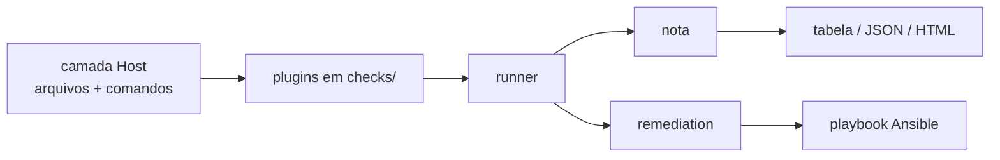

# blindagem 🛡️

> Auditor de hardening somente leitura para servidores Linux: verificações inspiradas no CIS, nota de 0 a 100, relatório HTML e um playbook Ansible para corrigir o que estiver errado.


[Read in English](README.md)

## Por que existe

A maioria das invasões de servidor começa com uma configuração banal: login de root por SSH,
política de senha fraca, um serviço esquecido no ar, `/etc/shadow` legível por qualquer um.
O blindagem encontra isso em segundos, explica o que um atacante faria com cada falha e gera
a correção — sem alterar nada por conta própria.

## Uso rápido

```bash
pipx install git+https://github.com/USUARIO/blindagem
sudo blindagem audit --html relatorio.html
blindagem fix -o fix.yml && ansible-playbook -i meuservidor, fix.yml --check --diff
```

Ou copie um arquivo só para o servidor: baixe o `blindagem.pyz` da última release e rode
`sudo python3 blindagem.pyz audit`. Sem pip, sem virtualenv, sem instalar nada na máquina.

## O que faz

- **29 verificações** em SSH, contas, permissões, rede, kernel, atualizações, serviços e
  opções de montagem — a lista está em [docs/checks.md](docs/checks.md).
- **Nota acompanhada da cobertura**, para que 95 com 3 verificações avaliadas não se passe
  por servidor seguro.
- **`explain <id>`** para cada verificação: o que olha, por que importa, como corrigir.
- **Relatório HTML autocontido** — um arquivo, sem rede, abre em qualquer lugar.
- **`fix -o fix.yml`** monta um playbook Ansible só com o que falhou, com tags por
  verificação e por categoria, e proteções que se recusam a trancar você para fora.
- **`--root /mnt/imagem`** audita uma imagem montada ou um backup, offline.
- **`--fail-under 70`** sai com código diferente de zero, para usar como etapa de pipeline.
- **`--compare antigo.json`** mostra o que melhorou e o que piorou desde a última execução.

## Comandos

| Comando | O que faz |
|---|---|
| `blindagem audit` | Audita o sistema e mostra a tabela. Não altera nada. |
| `blindagem audit --json -o r.json` | Relatório em JSON (formato em `docs/report-format.md`). |
| `blindagem audit --html r.html` | Relatório HTML autocontido. |
| `blindagem list-checks` | Lista todas as verificações. |
| `blindagem explain ssh.root_login` | Explica uma verificação em detalhe. |
| `blindagem fix -o fix.yml` | Gera o playbook Ansible das falhas encontradas. |

## Como está organizado



Nenhuma verificação lê arquivo ou roda comando por conta própria: tudo passa pelo `Host`, que
tem um `root` configurável. É isso que permite testar contra um rootfs falso dentro do
repositório (a suíte inteira roda em menos de um segundo, sem container e sem root) e auditar
imagens offline com `--root`.

Detalhes em [docs/architecture.md](docs/architecture.md).

## Decisões técnicas

- **Auditoria somente leitura.** A correção é um artefato separado, que o administrador revisa
  antes de aplicar. É o que torna a ferramenta segura para rodar em produção no meio do dia.
- **Uma camada `Host` para tudo.** Testes rápidos e auditoria offline saem de graça.
- **Resultados honestos.** `skip` e `error` ficam fora da nota e aparecem como cobertura, em
  vez de contar como aprovado. Qualquer falha `critical` limita a nota a 49: uma conta sem
  senha anula o resto.
- **Exceções continuam visíveis.** Uma exceção no `blindagem.yaml` conta como aprovada na
  nota, mas aparece no relatório com a justificativa. Nada some.
- **Proteção contra trancar o acesso.** Antes de endurecer o SSH ou ligar o firewall, o
  playbook confirma que existe chave utilizável e que a porta do SSH está liberada.

## Status das verificações

| Status | Significado |
|---|---|
| `pass` | Verificado, está correto. |
| `fail` | Verificado, está errado. |
| `warn` | Verificado, defensável em alguns cenários. Custa metade de uma falha. |
| `skip` | Não se aplica aqui (firewalld no Debian, systemd em container). |
| `error` | Não deu para verificar (sem root, arquivo ilegível, comando ausente). |

## Configuração

```yaml
# blindagem.yaml
profile: server            # server | workstation | container
exceptions:
  net.ip_forward: este host roda containers, então precisa encaminhar pacotes
```

Modelo completo em [blindagem.yaml.example](blindagem.yaml.example).

## Testes

```bash
pytest -m "not docker"    # unitários com rootfs falso, ~1s
pytest -m docker          # audita os containers fraco e endurecido
bash tests/e2e/run.sh     # audita -> aplica o playbook -> audita de novo, a nota tem que subir
```

## Avisos de segurança

- A auditoria lê; nunca altera o sistema auditado.
- Os relatórios citam o nome da conta ou do arquivo, nunca o hash da senha, a chave ou o
  conteúdo de um arquivo de configuração.
- O container fraco em `tests/docker/` é mal configurado de propósito. Serve para teste local
  e CI — nunca exponha na rede.
- Teste correção de SSH ou firewall primeiro numa máquina com acesso de console.

## Licença

MIT
