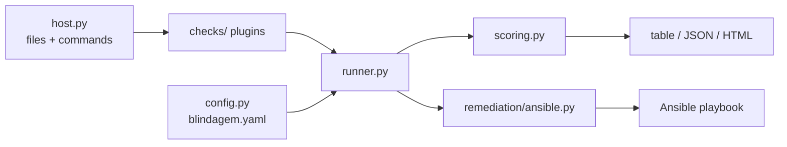

# Architecture



## The one rule

No check touches the filesystem or runs a command directly. Everything goes through
`Host`, which carries a `root` (default `/`). Two things fall out of that:

- **Tests** point `root` at `tests/fixtures/rootfs`, a fake system in the repository. No
  container, no VM, no root privileges — the whole unit suite runs in under a second.
- **Offline audits** work for free: `blindagem audit --root /mnt/image` inspects a mounted
  disk image or a backup. Commands return `None` there, because a command would describe the
  machine running the audit, not the image.

## The pieces

| Module | Responsibility |
|---|---|
| `host.py` | Read files, stat, glob, sysctl, run commands. The only place with I/O. |
| `models.py` | `Status`, `Severity`, `CheckResult`, `CheckMeta`, `Report`. |
| `registry.py` | The `@check` decorator and the plugin discovery that imports `checks/`. |
| `runner.py` | Runs each check, applies the profile and exceptions, catches everything. |
| `scoring.py` | Weights, the critical cap, per-category tallies. |
| `config.py` | `blindagem.yaml`: profile, accepted exceptions, SUID allowlist. |
| `checks/` | One module per category. Each check is a function plus its metadata. |
| `report/` | JSON (machine-readable, the input for `--compare`) and HTML (for humans). |
| `remediation/` | One Ansible task file per fixable check, assembled into a playbook. |

## Adding a check

```python
@check(CheckMeta(
    id="net.ip_forward", title="The machine does not route packets",
    category="network", severity=Severity.MEDIUM,
    rationale="Why an attacker cares, in plain language.",
    remediation="What the administrator should do.",
    reference="CIS Linux Benchmark 3.2 (network parameters)",
    skip_profiles=("container",),   # where the check makes no sense
    needs_root=False,               # the runner turns this into an error without root
))
def ip_forward(host: Host) -> CheckResult:
    ...
```

Then: a `pass` test, a `fail` test, and — if the fix is safe to automate — a task file at
`remediation/tasks/<id>.yml`. A test walks the registry and fails the build if a check has
no rationale or no remediation text.

## Status, and why `skip` is not `pass`

| Status | Meaning |
|---|---|
| `pass` | Verified, and the configuration is sound. |
| `fail` | Verified, and it is wrong. |
| `warn` | Verified, defensible in some setups, worth a look. Costs half of a fail. |
| `skip` | Does not apply here (firewalld on Debian, systemd in a container). |
| `error` | Could not be checked (no root, unreadable file, missing command). |

`skip` and `error` are excluded from the score and reported as coverage. A 95 out of three
evaluated checks is not a hardened server, and the report says so.

## What the audit never does

- Change anything. Remediation is a separate artifact the administrator reads first.
- Use `shell=True`, or build a command from text read out of the audited system.
- Put a password hash, a key or a config file's contents in a report. Findings name the
  account or the file; the value stays where it was.
